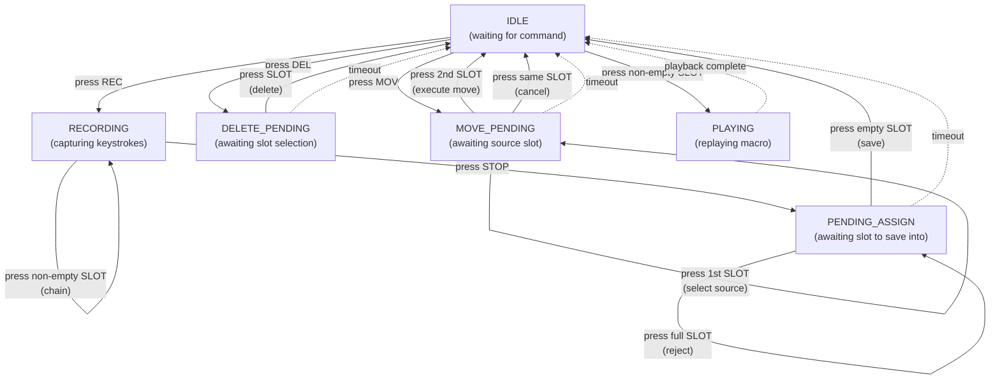

# zmk-dynamic-macros

A [ZMK](https://zmk.dev/) module that adds dynamic macro recording and playback to your keyboard. Record keystrokes on the fly, assign them to NVS-backed or RAM-only slots, and replay them with a single keypress.

## Features

- **Record** keystrokes from either half of a split keyboard
- **Play back** macros with configurable inter-event delay
- **Assign** recordings to configurable NVS-backed and RAM-only slots
- **Delete** individual macro slots
- **Move** macros between slots to reorganize, promote RAM macros to NVS, or demote NVS macros to RAM
- **Chain** existing macros into a new recording to build compound macros
- **Status** output showing all filled slots with their contents
- **Typed slot bindings** let keymaps choose NVS or RAM slots directly with `DM_SLOT_NVS` and `DM_SLOT_RAM`
- **NVS slots** persist across reboots and are labeled `N0`, `N1`, etc.
- **RAM slots** are temporary, never touch flash, and are labeled after the NVS range, such as `R8`
- **Async NVS persistence** to reduce USB stalls during flash writes
- **Typed feedback levels** from off to verbose previews; status and feedback type into the active host window, so trigger them in a safe text field

## Use Cases

Dynamic macros record raw HID events, so a single macro can mix typed text with modifier combos, navigation, and editing commands. Each key press + release costs 2 events; the default limit is 64 events per slot (32 full key taps).

### Text shortcuts


| Record                           | Status preview                      | Events | Use                         |
| -------------------------------- | ----------------------------------- | ------ | --------------------------- |
| `user@example.com`               | `N0: 'user@example.com' (36)`       | 36     | Fill in your email on forms |
| `Best regards,` + Enter + `John` | `N1: 'Best regards,<RET>John' (38)` | 38     | Email sign-off              |
| `Thanks, will do!`               | `N2: 'Thanks, will do!' (34)`       | 34     | Quick acknowledgement       |
| `:-)`                            | `N3: ':-)' (6)`                     | 6      | Emoticons                   |


### Code snippets


| Record                         | Status preview                          | Events | Use                                               |
| ------------------------------ | --------------------------------------- | ------ | ------------------------------------------------- |
| `console.log();` + Left + Left | `N4: 'console.log();<LEFT><LEFT>' (34)` | 34     | JS debug print -- cursor lands between the parens |
| `() => {}` + Left              | `N5: '() => {}<LEFT>' (18)`             | 18     | Arrow function skeleton                           |
| `[]()` + Left + Left + Left    | `N6: '[]()<LEFT><LEFT><LEFT>' (14)`     | 14     | Markdown link template -- cursor in the brackets  |


### Editing operations


| Record                  | Status preview                        | Events | Use                          |
| ----------------------- | ------------------------------------- | ------ | ---------------------------- |
| Ctrl+A, Ctrl+C          | `N7: '<LCTL+A><LCTL+C>' (8)`          | 8      | Select all and copy          |
| Ctrl+S, Ctrl+W          | `R8: '<LCTL+S><LCTL+W>' (8)`          | 8      | Save and close tab           |
| Home, Shift+End, Ctrl+C | `R9: '<HOME><LSFT+END><LCTL+C>' (10)` | 10     | Select current line and copy |


### Mixed text and actions

These combine typed text with modifier combos and navigation in one recording.


| Record                           | Status preview                        | Events | Use                                                                 |
| -------------------------------- | ------------------------------------- | ------ | ------------------------------------------------------------------- |
| `git commit -m ""` + Left        | `R10: 'git commit -m ""<LEFT>' (36)`  | 36     | Git commit -- cursor between the quotes, ready to type your message |
| Ctrl+H, then type `TODO`         | `R11: '<LCTL+H>TODO' (12)`            | 12     | Open find/replace pre-filled with a search term                     |
| Ctrl+T, type `github.com`, Enter | `R12: '<LCTL+T>github.com<RET>' (26)` | 26     | New browser tab straight to a URL                                   |


### Creative and CAD workflows

Hotkey-heavy applications like Photoshop, Blender, and CAD tools benefit from chaining multiple shortcuts into a single key.


| Record                              | Status preview                          | Events | Use                                                                         |
| ----------------------------------- | --------------------------------------- | ------ | --------------------------------------------------------------------------- |
| Ctrl+J, Ctrl+T                      | `R13: '<LCTL+J><LCTL+T>' (8)`           | 8      | Photoshop -- duplicate layer and enter Free Transform in one tap            |
| Ctrl+Shift+N, type `Sketch1`, Enter | `R14: '<LCTL+LSFT+N>Sketch1<RET>' (20)` | 20     | CAD / Photoshop -- new layer/sketch with a preset name, skipping the dialog |
| Ctrl+Alt+Shift+E                    | `R15: '<LCTL+LALT+LSFT+E>' (8)`         | 8      | Photoshop -- stamp visible (flatten all layers into a new layer)            |


### Compound macros

Chaining lets you build larger workflows from smaller recorded pieces.


| Building blocks                                           | Compound recording                                                      | Use                                                               |
| --------------------------------------------------------- | ----------------------------------------------------------------------- | ----------------------------------------------------------------- |
| `N0: 'git add .<RET>'` and `N1: 'git commit -m ""<LEFT>'` | Record a new slot, press slot N0, press slot N1                         | Stage changes and start a commit message                          |
| `N2: 'Hi Benjamin,<RET><RET>'`                            | Chain N2, then type a custom message, then chain an email sign-off slot | Reuse a greeting across multiple email templates                  |
| `R8: '<LCTL+S>'` and `R9: '<LCTL+W>'`                     | Chain R8 and R9 into one NVS slot                                       | Promote a temporary save-and-close workflow to a persistent macro |


## Setup

### 1. Add to west.yml

Add the module to your `config/west.yml` under the `projects` section:

```yaml
manifest:
  projects:
    # ... other projects
    - name: zmk-dynamic-macros
      path: modules/zmk/dynamic-macros
      url: https://github.com/BenjaminCIQ/dynamic_macros
      revision: main
```

### 2. Add includes to your keymap

At the top of your `.keymap` file:

```dts
#include <dt-bindings/zmk/dynamic_macros.h>
#include <behaviors/dynamic_macro.dtsi>
```

### 3. Add a macro layer

Create a layer in your keymap with slot keys and control keys:

```dts
#define MACRO 6  /* adjust layer number as needed */

layer_Macro {
    display-name = "Macro";
    bindings = <
        &dm DM_SLOT_NVS 0  &dm DM_SLOT_NVS 1  &dm DM_SLOT_NVS 2  &dm DM_SLOT_NVS 3  &none
        &dm DM_SLOT_NVS 4  &dm DM_SLOT_NVS 5  &dm DM_SLOT_NVS 6  &dm DM_SLOT_NVS 7  &none
        &none              &none              &none              &none              &none
                           &dm DM_REC 0       &dm DM_STP 0       &dm DM_DEL 0
        /* right side */
        &none              &dm DM_SLOT_RAM 0  &dm DM_SLOT_RAM 1  &dm DM_SLOT_RAM 2  &dm DM_SLOT_RAM 3
        &none              &dm DM_SLOT_RAM 4  &dm DM_SLOT_RAM 5  &dm DM_SLOT_RAM 6  &dm DM_SLOT_RAM 7
        &none              &none              &none              &none              &none
                           &dm DM_MOV 0       &dm DM_STATE 0     &tog MACRO
    >;
};
```

### 4. Optional: configure in .conf

Add any overrides to your board's `.conf` file (e.g., `dasbob.conf`):

```ini
# All settings below show their defaults -- only add lines you want to change.
# CONFIG_ZMK_BEHAVIOR_DYNAMIC_MACRO_MAX_EVENTS=64
# CONFIG_ZMK_BEHAVIOR_DYNAMIC_MACRO_TAP_DELAY=30
# CONFIG_ZMK_BEHAVIOR_DYNAMIC_MACRO_ASSIGN_TIMEOUT=10000
# CONFIG_ZMK_BEHAVIOR_DYNAMIC_MACRO_PERSIST=y
# CONFIG_ZMK_BEHAVIOR_DYNAMIC_MACRO_NVS_SLOTS=8
# CONFIG_ZMK_BEHAVIOR_DYNAMIC_MACRO_RAM_SLOTS=8
# CONFIG_ZMK_BEHAVIOR_DYNAMIC_MACRO_FEEDBACK_BASIC=y
```

## Usage

### Recording a macro

1. Switch to the macro layer
2. Press **REC** -- feedback types `[DM REC]`
3. Switch back to your base layer and type the keystrokes you want to record
4. Switch to the macro layer and press **STOP** -- feedback types `[DM STOP]`
5. Press a **slot key** to store the recording -- basic feedback types `[DM SAVED N0]` or `[DM SAVED R8]`; verbose feedback includes the macro preview

If the slot is already occupied, you'll see `[DM SLOT N0 FULL]` or `[DM SLOT R8 FULL]` and the module stays in assign mode so you can pick another slot. You must delete the existing macro first to reuse that slot.

If you don't press a slot key within the assign timeout (default 10 seconds), the recording is discarded.

### Playing a macro

1. Switch to the macro layer
2. Press a **slot key** that has a recorded macro
3. The macro plays back automatically

### Deleting a macro

1. Switch to the macro layer
2. Press **DEL** to enter delete mode
3. Press the **slot key** you want to clear -- RAM slots clear immediately; NVS slots are queued for deletion and confirm after flash storage succeeds

If the slot is already empty, you'll see `[DM SLOT N0 EMPTY]` or `[DM SLOT R8 EMPTY]`.

### Moving a macro

1. Switch to the macro layer
2. Press **MOV** -- feedback types `[DM MOV]`
3. Press the **source slot** -- feedback types `[DM MOV SRC N0]` or similar
4. Press the **destination slot** -- feedback types `[DM MOV N0->R8]` or similar

The destination slot must be empty. If it is full, you'll see `[DM SLOT R8 FULL]` and move mode stays active so you can pick another destination.

MOVE works across all storage combinations:

- RAM to NVS promotes a temporary macro to persistent storage
- NVS to RAM demotes a persistent macro to temporary storage
- RAM to RAM reorganizes temporary slots without touching flash
- NVS to NVS reorganizes persistent slots and updates flash

### Chaining macros during recording

While recording a new macro, press a non-empty **slot key** to inline that slot's events into the current recording.

1. Switch to the macro layer
2. Press **REC**
3. Type some keys, or switch to the macro layer immediately
4. Press a non-empty **slot key** to chain it into the recording
5. Continue typing or chain more slots
6. Press **STOP**, then assign the compound recording to an empty slot

When a slot is chained, the module copies the slot's raw HID events into the current recording and types a safe text preview of the chained content into the active host window. For example, chaining a slot containing `hello` previews `hello`; chaining a slot containing Ctrl+C previews the literal token `<LCTL+C>` instead of executing Ctrl+C.

Considerations:

- Chained content is a snapshot. Editing or deleting the source slot later does not change compound macros that already inlined it.
- The combined recording must still fit within `CONFIG_ZMK_BEHAVIOR_DYNAMIC_MACRO_MAX_EVENTS`. If a chained slot would overflow the buffer, the insert is rejected with `[DM +N0 FULL]` and recording continues.
- Chaining an empty slot types `[DM SLOT N0 EMPTY]` and recording continues.
- The preview text appears in whichever host window has focus during recording, unless feedback is disabled.
- There is no recursion risk. Chaining flat-copies recorded events, not references to other slots.

### Viewing status

1. Switch to the macro layer
2. Press **STATE** -- basic feedback types a short summary; verbose feedback types a full listing of all slots with their contents

`STATE` types into whichever PC window currently has focus. Verbose output can type many lines, so use it in a safe text editor or lower/disable feedback if that is disruptive.

Verbose example output:

```
[DM 2/16 NVS:0-7 RAM:8-15]
N0: 'Hello world' (22)
N1: -
N2: '<LCTL+C><LCTL+V>' (8)
...
R8: -
```

### Re-recording

Pressing **REC** while already recording restarts the recording (discards the current buffer).

## Commands Reference


| Keymap binding   | Action                                                                                                                                     |
| ---------------- | ------------------------------------------------------------------------------------------------------------------------------------------ |
| `&dm DM_REC 0`   | Start recording (param2 is unused, pass 0)                                                                                                 |
| `&dm DM_STP 0`   | Stop recording, enter assign mode                                                                                                          |
| `&dm DM_DEL 0`   | Enter delete mode                                                                                                                          |
| `&dm DM_MOV 0`   | Enter move mode; press source slot, then destination slot                                                                                  |
| `&dm DM_STATE 0` | Output status of all slots                                                                                                                 |
| `&dm DM_SLOT_NVS N` | Interact with NVS slot N (play, assign, delete, move-select, or chain depending on current state); N must be less than `NVS_SLOTS`       |
| `&dm DM_SLOT_RAM N` | Interact with RAM slot N (play, assign, delete, move-select, or chain depending on current state); N must be less than `RAM_SLOTS`       |


## State Machine

Solid arrows are **user key presses** (input). Dotted arrows are **system events** (automatic).



Normal keyboard input is captured while in RECORDING but does not change the state. Typed feedback (e.g. `[DM REC]`, `[DM SAVED N0]`) is handled internally by a transient typing state that returns to the appropriate state shown above.

## Kconfig Options


| Option                                                            | Type   | Default | Description                                                                               |
| ----------------------------------------------------------------- | ------ | ------- | ----------------------------------------------------------------------------------------- |
| `CONFIG_ZMK_BEHAVIOR_DYNAMIC_MACRO_MAX_EVENTS`                    | int    | 64      | Max events per slot. Each key press + release = 2 events, so 64 events = 32 full key taps |
| `CONFIG_ZMK_BEHAVIOR_DYNAMIC_MACRO_TAP_DELAY`                     | int    | 30      | Milliseconds between events during playback and feedback typing                           |
| `CONFIG_ZMK_BEHAVIOR_DYNAMIC_MACRO_ASSIGN_TIMEOUT`                | int    | 10000   | Milliseconds before pending assign/delete mode auto-cancels                               |
| `CONFIG_ZMK_BEHAVIOR_DYNAMIC_MACRO_PERSIST`                       | bool   | y       | Enable NVS flash persistence (requires `CONFIG_SETTINGS`)                                 |
| `CONFIG_ZMK_BEHAVIOR_DYNAMIC_MACRO_NVS_SLOTS`                     | int    | 8       | Number of low-index persistent slots backed by NVS flash, range 0-16                      |
| `CONFIG_ZMK_BEHAVIOR_DYNAMIC_MACRO_RAM_SLOTS`                     | int    | 8       | Number of RAM-only temporary slots after the NVS range, range 0-48                        |
| `CONFIG_ZMK_BEHAVIOR_DYNAMIC_MACRO_FEEDBACK_OFF`                  | choice | n       | Disable typed feedback                                                                    |
| `CONFIG_ZMK_BEHAVIOR_DYNAMIC_MACRO_FEEDBACK_ERROR`                | choice | n       | Type only serious errors, such as storage failures                                        |
| `CONFIG_ZMK_BEHAVIOR_DYNAMIC_MACRO_FEEDBACK_BASIC`                | choice | y       | Type short state/action messages                                                          |
| `CONFIG_ZMK_BEHAVIOR_DYNAMIC_MACRO_FEEDBACK_VERBOSE`              | choice | n       | Type saved previews and full status listings                                              |


## Constraints and Notes

### NVS and RAM Storage

Slots are split internally into NVS-backed and RAM-only ranges. `CONFIG_ZMK_BEHAVIOR_DYNAMIC_MACRO_NVS_SLOTS` controls how many low-index slots persist, and `CONFIG_ZMK_BEHAVIOR_DYNAMIC_MACRO_RAM_SLOTS` controls how many temporary slots follow them. With the defaults, internal slots 0-7 are persistent (`N0`-`N7`) and internal slots 8-15 are volatile (`R8`-`R15`).

Slot bindings use pool-relative indices, so `&dm DM_SLOT_RAM 0` addresses the first RAM slot even though feedback/status labels it as `R8` with the default 8 NVS slots.

NVS slots are capped at 16, RAM slots are capped at 48, and total slots are capped at 64. Keymap bindings such as `&dm DM_SLOT_NVS 8` or `&dm DM_SLOT_RAM 8` fail the build if the configured pool does not include that slot. Setting both slot counts to 0 is allowed and emits a Kconfig warning; the behavior still compiles, but no slot binding is valid.

If persistence is disabled, NVS slots are effectively 0. Set `CONFIG_ZMK_BEHAVIOR_DYNAMIC_MACRO_RAM_SLOTS` to the number of volatile slots you want.

With default settings (8 NVS slots, 64 events each), a completely full set of persisted slots uses roughly **6 KB** of NVS flash storage before backend overhead. The nRF52840 (nice_nano) typically has a 24-32 KB NVS partition shared with BLE bonds and other ZMK settings. This fits comfortably, but be mindful if you increase `MAX_EVENTS` or `NVS_SLOTS` significantly.

Storage per slot is compact and only writes recorded events: `4 bytes (event count) + event_count * sizeof(struct dm_event)`. On typical ZMK targets, `struct dm_event` is padded to about 12 bytes, so a full 64-event slot is about 772 bytes before storage backend overhead.

NVS saves and deletes are queued on a low-priority work queue. The macro is usable from RAM immediately after assignment; flash persistence completes shortly after. This reduces the chance of USB stalls during NVS writes or garbage collection. RAM-only slots never touch flash.

### RAM Usage

The module keeps all slots plus one recording buffer in RAM:
`(NVS_SLOTS + RAM_SLOTS + 1) * (4 + MAX_EVENTS * sizeof(struct dm_event))`, or roughly **13 KB** with default settings on typical ZMK targets.

The nRF52840 has 256 KB RAM, so this is not a concern.

### Feedback Output

Typed feedback goes to **whatever application currently has focus** on the host computer. This means:

- `[DM REC]` will appear in your text editor, terminal, etc.
- Verbose STATUS output can type multiple lines of text

**Assumption:** The host keyboard layout is **US QWERTY**. Feedback text and macro previews use ASCII symbols (`[`, `]`, `:`, `'`, `+`) that map to specific HID keycodes assuming US QWERTY. If your host uses a different layout, wrapper symbols and printable preview characters may render differently.

Feedback levels:

- `CONFIG_ZMK_BEHAVIOR_DYNAMIC_MACRO_FEEDBACK_OFF=y`: no typed feedback.
- `CONFIG_ZMK_BEHAVIOR_DYNAMIC_MACRO_FEEDBACK_ERROR=y`: only serious errors, such as `[DM SAVE FAILED N3]`, `[DM DEL FAILED N3]`, `[DM SAVE QUEUE FULL N3]`, or `[DM DEL QUEUE FULL N3]`.
- `CONFIG_ZMK_BEHAVIOR_DYNAMIC_MACRO_FEEDBACK_BASIC=y`: short confirmations such as `[DM REC]`, `[DM STOP]`, `[DM SAVED N3]`, and `[DM DEL R8]`.
- `CONFIG_ZMK_BEHAVIOR_DYNAMIC_MACRO_FEEDBACK_VERBOSE=y`: saved macro previews and full status listings.

### Split Keyboards

The module runs on the **central** half only. ZMK's event system automatically merges key events from both halves on the central side, so keystrokes from either hand are captured during recording.

### Macro Content Display

When a macro is saved, its contents are displayed as a literal preview:

- **Printable text** (letters, numbers, punctuation, and spaces) is concatenated without extra separators, so `hello world` displays as `hello world`.
- **Shifted printable keys** render as the resulting character, so `LSFT+a` displays as `A` and `LSFT+1` displays as `!`.
- **Command/action keys** render inline as angle-bracket tokens, such as `<LCTL+C>`, `<TAB>`, `<BSPC>`, `<PGUP>`, or `<MEDIA>`.

Only Shift is treated as part of literal text output. Ctrl, Alt, Gui, navigation, editing, media, mouse, and other non-keyboard actions are shown as action tokens instead of being simulated in the preview.

### Macro Chaining

Chaining copies raw HID events from an existing slot into the recording buffer. The compound macro replays exactly what the source slot contained at the time it was chained.

The maximum size of a compound macro is still bounded by `CONFIG_ZMK_BEHAVIOR_DYNAMIC_MACRO_MAX_EVENTS` per slot. Chaining is rejected if the source slot would not fit in the remaining recording buffer space.

Layer switching keys are behaviors, not HID keycode events, so switching to the macro layer during recording to press a slot key does not pollute the recording. The chained slot key itself is also handled as a dynamic macro command rather than recorded as a key event.

### Slot Overwrite Protection

Assigning a recording to a slot that already contains a macro is **rejected**. You must explicitly delete the slot first. This prevents accidental overwriting.

## License

MIT